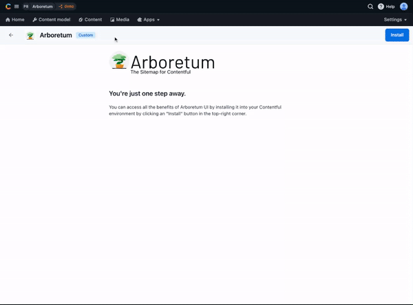

# A SSR website example using Next.js, Contentful and Arboretum SDK

This project showcases [Next.js](https://nextjs.org/) [Server-side Rendering (SSR)](https://nextjs.org/docs/pages/building-your-application/rendering/server-side-rendering) feature using [Contentful](https://www.contentful.com/) and [Arboretum SDK](https://github.com/BrightIT/arboretum-sdk).

## How to use

### Step 1. Create an account and a space on Contentful

First, [create an account on Contentful](https://www.contentful.com/sign-up/).

After creating an account, create a new empty **space**.

### Step 2. Install Arboretum app

The easiest way to get stared is to install [Arboretum app](https://www.contentful.com/marketplace/contentful-app/arboretum/) in yor environment in contentful. By selecting "Automatic" installation mode Arboretum app will take care of all required configuration and will create sample content.



### Step 3. Clone project

```bash
git clone git@github.com:BrightIT/arboretum-nextjs-example.git
cd arboretum-nextjs-example
```

### Step 4. Define .env.local

```bash
CONTENTFUL_SPACE=
CONTENTFUL_ENVIRONMENT=
CONTENTFUL_CDA_ACCESS_TOKEN=
CONTENTFUL_CPA_ACCESS_TOKEN=

ARBORETUM_REVALIDATION_MS=

# Arbitrary security token used to restrict access to preview mode
PREVIEW_SECURITY_TOKEN=
```

### Step 5. Start project
```bash
yarn dev
```
Open [http://localhost:3000](http://localhost:3000) with your browser to see the result.

## Deploy on Vercel

The easiest way to deploy your Next.js app is to use the [Vercel Platform](https://vercel.com/new?utm_medium=default-template&filter=next.js&utm_source=create-next-app&utm_campaign=create-next-app-readme) from the creators of Next.js.

Check out our [Next.js deployment documentation](https://nextjs.org/docs/deployment) for more details.
